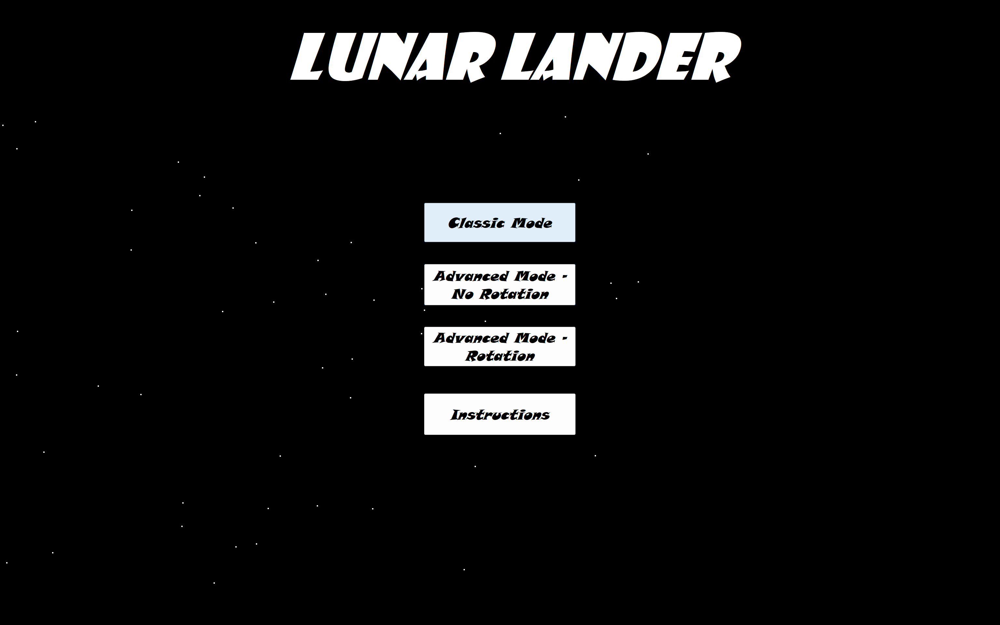
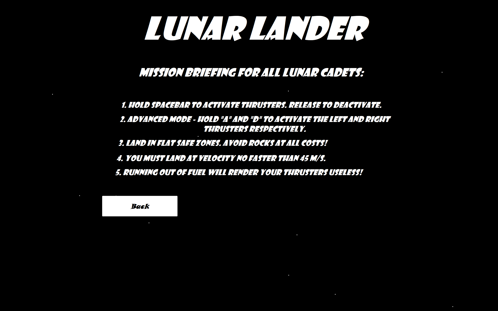
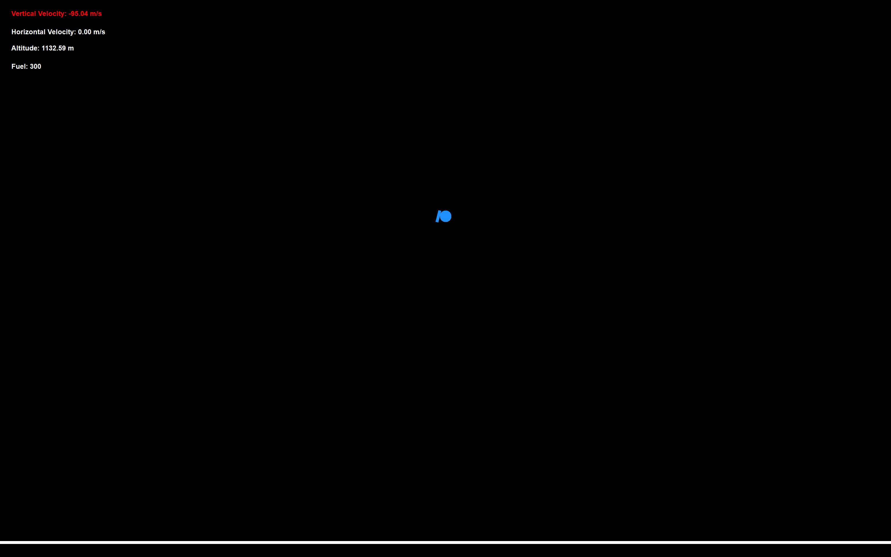
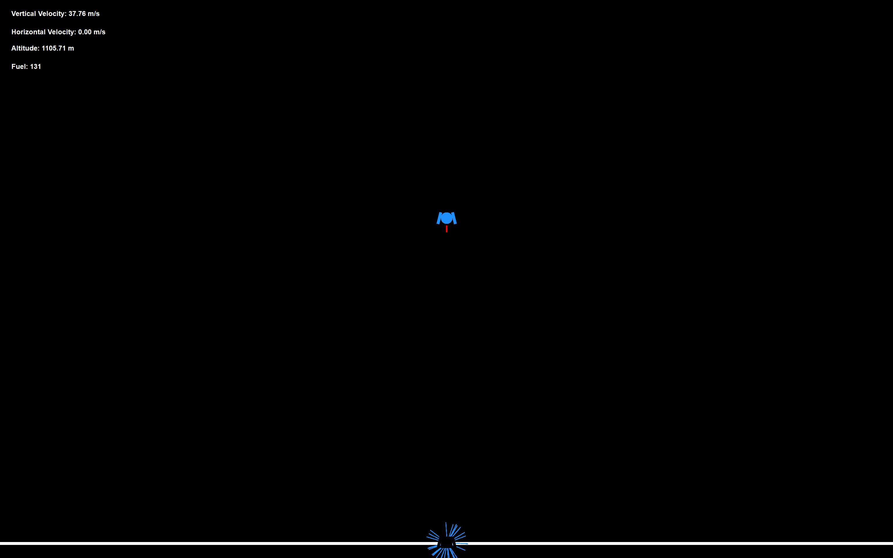

## 🎯 Project Goal
A recreation of the classic **Lunar Lander game** in **C#**, built with a focus on:  
- Object-oriented design with 10+ structured classes  
- Realistic **physics and trigonometry** in game mechanics  
- Interactive UI using **Windows Forms**  
- Custom graphics and **event-driven programming**  

Expanded beyond the basics with:  
- ✨ Custom menu effects and polished UI  
- ⚙️ A self-built **physics engine** for gravity and thrust utilizing projectile vector physics principles
- 🎮 Multiple **game modes** (classic, side-thrust, and rotation-based control)  

---

## 🕹️ Features

### ✅ Core Features
- 🚀 **Lunar lander ship** drawn with C# `Graphics` objects (`drawEllipse`, `drawLines`, etc.)  
- 🌑 **Gravity simulation** (lunar gravity ~1.6 m/s²) with adjustable starting heights  
- 🔥 **Main engine** controlled by the spacebar (burns fuel per second, produces upward thrust)  
- ⛽ **Fuel system** with depletion mechanics and a visual gauge  
- 📊 **HUD** displaying height, velocity, and fuel levels  
- 📋 **Menu options** (pause, help, toggle modes)  
- 💥 **Crash/Failure** if landing speed exceeds safe threshold  
- ↔️ **Left/Right thrusters** with horizontal velocity persistence  
- 🪨 **Surface obstacles** (rocks that destroy the ship on contact)  
- 🔄 **Rotational controls** (rotate lander in vacuum, enabling angled thrust movement)  

### 🚀 Advanced / Extra Features
- 🎨 **Polished menus and UI effects** (help, pause, toggle between modes)  
- ⚙️ **Custom physics engine** handling gravity, thrust, velocity, and collisions  
- 🎮 **Multiple game modes**:
  1. Classic vertical lander  
  2. Side-thrust controls  
  3. Rotation-based controls with full vector physics  
- 🌌 **Wrap-around mechanics** (fly off-screen left → appear on right, and vice versa)  
- 🧨 **Explosion and thruster animations** with expanding lines and circles  

---

## 🛠️ Technical Design
- Implemented using **C# Windows Forms**  
- Built with a structured **object-oriented design** (10+ classes) for:  
  - Lander physics  
  - Rendering system  
  - Input handling  
  - UI/Menu system  
  - Collision detection  
- Documentation and diagrams produced, including:  
  - 📐 **Class diagram** (stubbed classes with block comments)  
  - 📄 Written design doc explaining architecture and user interaction  

---

## 📖 Controls
- **Spacebar** → Toggle main engine (burns fuel, provides upward thrust)  
- **A / D** → Side engines or rotation (depending on game mode)  
- **Menu** → Switch between game modes, pause, or show help  

---

## 📱 Screenshots

## 📚 Resources Utilized
- [Lunar Lander (video game genre) – Wikipedia](https://en.wikipedia.org/wiki/Lunar_Lander_(video_game_genre))  
- [Geeks for Geeks](https://www.geeksforgeeks.org/)
- [W3 Schools](https://www.w3schools.com/cs/index.php)
- [Microsoft Learn](https://learn.microsoft.com/en-us/dotnet/csharp/tour-of-csharp/)
- [Youtube](https://www.youtube.com/)
- C# `Graphics` object documentation  

---

## 🌐 Misc
- My GitHub Portfolio: [github.com/Jordan1819](https://github.com/Jordan1819)  
